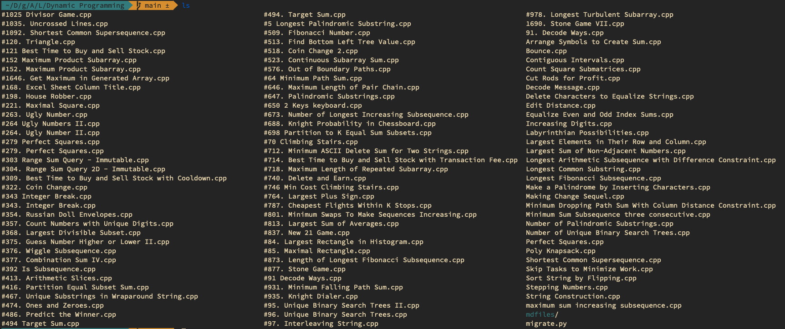
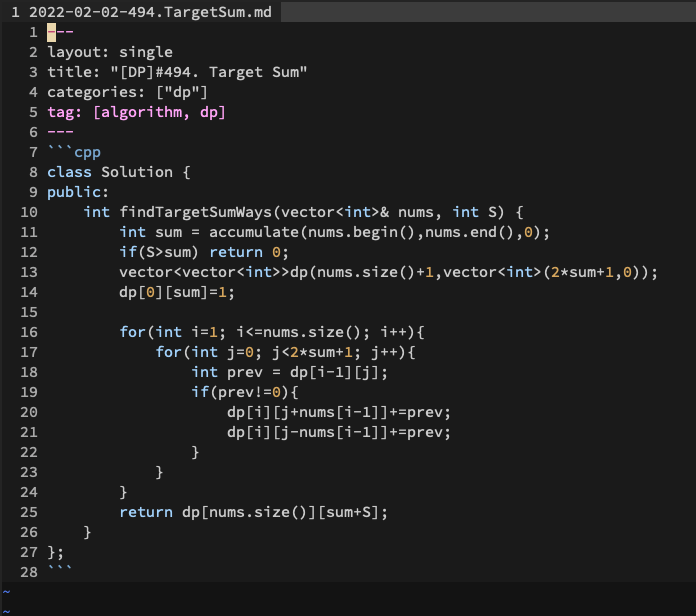

It's been almost over a week since I created my github.io blog site. I've been writing posts about deep learning and python until now.

But then, I realized that I have **tons** of my leetcode codes that I've been doing for years. It's more than 600 in total.

Of course, I'm not going to copy&paste each one. The extension of my codes is `.cpp` and I have to convert to `.md` file. Plus, I have to provide

```markdown
---
layout: single
title: "[Python] Variables"
categories: ["Python"]
tag: [python]
author_profile: true
sidebar_main: true
---
```

for every post.

So I wrote a python program that automatically converts `.cpp` file into the correct format.

Here's a list of `.cpp` files that I want to migrate.



Below is the `migrate.py` which does all the job. Let's look inside.

- Modify the configurations accordingly.
- The files you want to migrate must reside in the **same directory**. It's okay that other files or directories are in the same location.
  Only the files with given `EXTENSION` will be migrated (copied).
- Run the `migrate.py` in the same directory as your files as shown above in the picture.

````python
import os
import sys
import re

fname_list = os.listdir()

# CONFIGURATIONS - Modify Below
######################################################################################
EXTENSION = 'cpp' # Original extension of your files
DEST_LOCATION = '~/Desktop/jasonlee-github-blog/JasonLee-cp.github.io/_posts/Algorithm/DP/' # Destination location in Jekyll
TITLE_PREFIX = '[DP] ' # This is for "[category] title..." format. Replace with '' if you don't need it.
POST_CATEGORY = 'dp' # Jekyll post category
POSTING_DATE = '2022-02-02-' # Posting date
TAGS = ['algorithm', 'dp'] # List of tags for your post
REMOVE_LIST = ['#', ' '] # Remove from ".md" file name. Not the post title. The title will be the same as original file name with extension removed.
#######################################################################################

for fname in fname_list:
    if os.path.isdir(fname): # skip if it's a dir
        break
    if not fname.endswith(f'.{EXTENSION}'): # only covert files with given extension
        break

    with open(fname, 'r') as file:
        contents = f'---\nlayout: single\ntitle: "{TITLE_PREFIX}{fname[:-1*len(EXTENSION)]}"\ncategories: ["{POST_CATEGORY}"]\ntag: [{", ".join(TAGS)}]\n---\n```{EXTENSION}\n'
        while True:
            line = file.readline()
            if not line:
                break
            contents += line

    contents += '\n```'

    # convert .cpp to .md / remove whitespaces
    fname = re.sub(f'.{EXTENSION}', '.md', fname.strip())

    # Remove from '.md' file name, NOT from the post title
    for remove in REMOVE_LIST:
        remove = '\s' if remove == ' ' else remove
        fname = re.sub(remove,'', fname)

    fname = POSTING_DATE + fname.strip()

    # write file
    f = open(f'./mdfiles/{fname}','w')
    f.write(contents)
    f.close()

os.system(f"cp ./mdfiles/* {DEST_LOCATION}")

print("Migration Complete")
````

After you run the file, you'll see the converted files are saved in `mdfiles/` directory. Let's see.


Now let's look at one of the files if it's correctly converted.



Great. Everything seems good.
